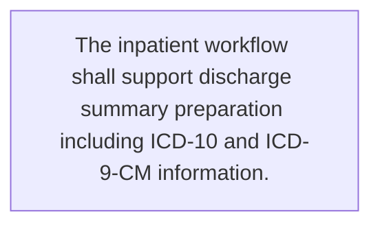

# Functional Requirements

This document captures the build-ready functional scope for **Features of the Medical Records System (MRS)**.

## Functional coverage snapshot

| Area | Value |
| --- | --- |
| Features | 11 |
| Workflows | 1 |
| Business rules | 2 |
| Data entities | 0 |
| Integrations | 4 |
| Constraints | 1 |

## Workflow map

## Features and capabilities

### FR-01 — Patient registration and profile management

- **Source:** Lines 13-19

The system shall support:
- Patient registration
- Demographic data entry
- Patient profile updates
- Allergy record management
- Emergency contact information management

### FR-02 — Outpatient encounter documentation

- **Source:** Lines 23-35

The system shall support OPD visit creation and documentation of:
- Vital signs
- Chief complaint
- History of present illness (HPI)
- Past medical history (PMH)
- Family history (FH)
- Medication history
- Physical examination
- ICD-10 diagnoses
- Treatment plan

### FR-03 — Outpatient orders and certificates

- **Source:** Lines 23-35

Within an OPD visit, the system shall support medication order entry, lab/X-ray order entry, and medical certificate generation.

### FR-04 — Inpatient admission and stay management

- **Source:** Lines 39-47

The system shall support:
- Patient admission management
- Nursing note documentation
- Doctor progress note documentation
- Intake and output charting
- Continuous vital sign monitoring
- Medication Administration Record (MAR) management
- Lab/X-ray order entry during admission
- Referral documentation

### FR-05 — Medication and pharmacy operations

- **Source:** Lines 51-57

The system shall support:
- Medication order entry
- Dispensing workflow management
- Lot number and expiry date tracking
- Drug inventory management
- Drug utilization reporting

### FR-06 — Laboratory order and result management

- **Source:** Lines 61-66

The system shall support:
- Laboratory order entry
- Barcode printing
- Laboratory result entry
- Graphical display of laboratory results
- Turnaround time (TAT) reporting

### FR-07 — Imaging and radiology management

- **Source:** Lines 70-73

The system shall support imaging orders for X-ray, CT, and MRI, along with radiologist report entry.

### FR-08 — Clinical document management

- **Source:** Lines 77-80

The system shall support document uploads in PDF and JPG formats and store:
- Consent forms
- Medical certificates
- Referral documents

### FR-09 — Appointment scheduling and schedule management

- **Source:** Lines 84-87

The system shall support patient appointment scheduling, doctor schedule management, and no-show reporting.

### FR-10 — Billing and insurance processing

- **Source:** Lines 91-95

The system shall support:
- Charge calculation
- Medication, procedure, and room charge management
- Insurance eligibility verification
- Invoice and receipt generation
- Revenue reporting

### FR-11 — Operational and regulatory reporting

- **Source:** Lines 142-146

The system shall provide:
- Daily patient census reports
- ICD-10 disease reports
- Drug utilization reports
- OPD/IPD statistical reports
- Reports for the provincial health office / NHSO

## Workflows and process steps

### WF-01 — Inpatient discharge documentation

- **Source:** Lines 39-47

The inpatient workflow shall support discharge summary preparation including ICD-10 and ICD-9-CM information.

## Business rules

### BR-01 — Detect potential duplicate patients

- **Source:** Lines 13-19

Patient registration and search shall include duplicate patient detection to reduce duplicate records.

### BR-02 — Apply medication safety checks

- **Source:** Lines 51-57

Medication workflows shall include drug interaction checking and allergy checking.

## Data entities

No entries were captured for this category in the current baseline.

## Integrations

### INT-01 — Integrate laboratory results into the medical record

- **Source:** Lines 61-66

Laboratory results shall integrate with the patient medical record.

### INT-02 — Support PACS and image attachments

- **Source:** Lines 70-73

The imaging module shall support:
- PACS integration
- Image attachment support for DICOM and JPEG

### INT-03 — Send appointment reminders through messaging channels

- **Source:** Lines 84-87

The appointment system shall support reminders via SMS and LINE.

### INT-04 — External healthcare and enterprise integrations

- **Source:** Lines 134-138

The system shall integrate with:
- HIS via APIs
- Laboratory systems
- PACS
- Billing systems
- Insurance and eligibility systems

## Constraints

### CON-01 — Clinical coding, privacy, and regulatory compliance

- **Source:** Lines 124-130

The system shall comply with:
- ICD-10
- ICD-9-CM
- LOINC
- PDPA
- Ministry of Public Health medical record standards
- Healthcare data security standards

SNOMED CT support is noted as optional.

## Engineering delivery notes

- **BR-01 — Detect potential duplicate patients**
  - Patient registration and search shall include duplicate patient detection to reduce duplicate records.
  - Suggested follow-up: Review 'Detect potential duplicate patients' with the delivery team.
- **BR-02 — Apply medication safety checks**
  - Medication workflows shall include drug interaction checking and allergy checking.
  - Suggested follow-up: Review 'Apply medication safety checks' with the delivery team.
- **INT-01 — Integrate laboratory results into the medical record**
  - Laboratory results shall integrate with the patient medical record.
  - Suggested follow-up: Review 'Integrate laboratory results into the medical record' with the delivery team.
- **INT-02 — Support PACS and image attachments**
  - The imaging module shall support: - PACS integration - Image attachment support for DICOM and JPEG
  - Suggested follow-up: Review 'Support PACS and image attachments' with the delivery team.
- **INT-03 — Send appointment reminders through messaging channels**
  - The appointment system shall support reminders via SMS and LINE.
  - Suggested follow-up: Review 'Send appointment reminders through messaging channels' with the delivery team.
- **INT-04 — External healthcare and enterprise integrations**
  - The system shall integrate with: - HIS via APIs - Laboratory systems - PACS - Billing systems - Insurance and eligibility systems
  - Suggested follow-up: Review 'External healthcare and enterprise integrations' with the delivery team.
- **CON-01 — Clinical coding, privacy, and regulatory compliance**
  - The system shall comply with: - ICD-10 - ICD-9-CM - LOINC - PDPA - Ministry of Public Health medical record standards - Healthcare data security standards SNOMED CT support is noted as optional.
  - Suggested follow-up: Review 'Clinical coding, privacy, and regulatory compliance' with the delivery team.